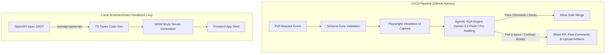

# 💼 Enterprise QA & Architecture Assets (Public Portfolio)

> **"Eliminating Flaky Tests & API Drift via AI and Schema-Driven Safety"**
>
> A production-grade, executable architectural boilerplate that demonstrates how to solve the two biggest bottlenecks in modern software delivery pipelines: **unstable, flaky visual regression testing** and **frontend-backend contract mismatch (API drift)**. 

[](#)
[](#)
[](#)
[](LICENSE)

---

## 🚀 The Business Problem & Solution (Why This Exists)

In high-velocity engineering organizations, software delivery velocity is heavily throttled by two critical bottlenecks:

1. **Flaky & Brittle Visual Regression QA:** Standard pixel-by-pixel image comparisons are notoriously flaky under varying render speeds, fonts, and sub-pixel antialiasing. This causes false positives that block CI/CD pipelines, increase cognitive load, and waste valuable developer hours.
2. **Frontend-Backend Interface Drift:** Out-of-sync API contracts create silent bugs that bypass static code analysis and only surface as runtime failures in production, causing expensive refactoring and manual rollbacks.

### The Unified Architecture Solution:

This repository acts as an **executable proof-of-concept (PoC)** implementing two enterprise-ready architectural solutions:

#### 1. Agentic Visual QA Engine (`src/vqa_engine/`)
Replaces fragile pixel-by-pixel comparisons with an **agentic VLM (Google Gemini 2.5 Flash / Pro) layout auditor** that evaluates UI screenshots using **Semantic Grounding** (evaluating visual components like a human designer would).
* **Robust Features:** Implements type-safe JSON schema enforcement using Pydantic, dynamic prompt structures, and exponential backoff retry mechanics via Tenacity. Defaulting to Gemini 2.5 Flash provides lightning-fast evaluations and minimal operating costs.
* **Impact:** Eliminates flaky test noise, catches actual layout breaks (e.g., text wrapping over buttons), and cuts manual QA verify cycles by ~80%.

#### 2. Schema-Driven Development Sync (`src/schema_sync/`)
Enforces a strict contract-safety pipeline by treating OpenAPI specifications (`docs/api_specs/openapi.yaml`) as the absolute **Single Source of Truth (SSOT)**.
* **Robust Features:** Automatically generates type-safe TypeScript interfaces and mirrors them to a mock server infrastructure using Mock Service Worker (MSW).
* **Impact:** Any changes to the API specs immediately fail frontend compile checks locally and in CI—completely preventing contract drift and interface mismatches from reaching production.

---

## 🏗️ System Architecture & CI/CD Pipeline



---

## 📂 Directory Structure

```text
ai-qa-architecture-portfolio/
├── .github/workflows/   # Automated CI/CD pipelines with artifact archival
├── docs/                
│   ├── adr/             # Architecture Decision Records (Technical justifications & trade-offs)
│   └── api_specs/       # OpenAPI 3.0 API Contract Specs
├── dummy-app/           # Reference frontend shell to demonstrate visual QA passes and failures
├── src/                 # Executable Core Microservices
│   ├── schema_sync/     # OpenAPI compilation & MSW mock sync pipelines
│   └── vqa_engine/      # Gemini 2.5 Flash / Pro Agentic VQA engine with Pydantic schemas
├── terraform/           # Declarative GCP & GitHub resource provisioning (IaC)
└── tests/               # Playwright automated headless browser test setup
```

---

## 📖 Architecture Decision Records (ADR)

We document our engineering tradeoffs and architectural justifications formally. Please read the records below:
* [ADR-001: Adopting VLM (Vision-Language Model) for Semantic Visual QA](./docs/adr/001-agentic-vqa-vlm.md)
* [ADR-002: Enforcing OpenAPI as the SSOT for Schema-Driven Development](./docs/adr/002-schema-driven-development.md)

---

## 🗺️ Future Roadmap

To explore our long-term roadmap for this template—including autonomous agent routing, self-expanding E2E mock generation, and advanced FinOps performance tracking—please check [ROADMAP.md](./ROADMAP.md).

---

## 📄 License

This project is licensed under the MIT License.
