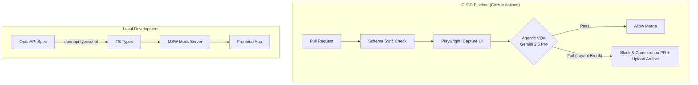

# 💼 Enterprise QA & Architecture Assets (Public Portfolio)


このリポジトリは、リードエンジニア・アーキテクトとしての自身の技術的知見を、実際に動作するボイラープレートとしてパッケージ化した**公開用ポートフォリオ**です。
単なるツールの寄せ集めではなく、**「開発組織のベロシティを落とさず、QAコストを劇的に削減する」という経営課題（FinOps）を解決するための実証コード**となっています。

---

## 🚀 The Business Problem & Solution (なぜこれを作ったか)

現代のWeb開発において、開発組織が直面する最大のペインは以下の2点です。
1. **QA（品質保証）のボトルネック化:** 属人的な手動テストや、ピクセル単位のFlaky（不安定）なE2EテストがCIをブロックし、リリース速度を低下させている。
2. **フロント/バックエンドの仕様ズレ:** コミュニケーション不足によるAPIのインターフェースズレが手戻りを生み、リードタイムを悪化させている。

### My Solution: "AIとSchemaによる完全自動化"

本リポジトリは、これらの課題を解決する以下の2つのコアエンジンを実装しています。

#### 1. Agentic Visual QA Engine (`src/vqa_engine/`)
従来の「ピクセル比較」ではなく、**VLM（Gemini 2.5 Pro）を用いて「人間が見て意味的に崩れていないか（Semantic Grounding）」を評価**する次世代のE2Eテスト基盤です。
* **特徴:** Pydanticを用いたStructured Outputsによる型安全なJSONパースと、Tenacityを用いたAPIリトライ機構（Exponential Backoff）を備えた本番運用品質。
* **効果:** Playwrightの自動撮影と連携し、手動QAを排除しつつ、FlakyなテストによるCIの偽陽性（False Positive）を劇的に削減します。

#### 2. Schema-Driven Development Sync (`src/schema_sync/`)
OpenAPI (`docs/api_specs/openapi.yaml`) をSSOT（Single Source of Truth）とし、フロントエンドの型定義からモックサーバー（MSW）までを全自動で同期する基盤です。
* **効果:** API仕様書の更新が即座にフロントエンドのコンパイルエラー（Drift）として検知され、インターフェース不一致による手戻りをゼロにします。

---

## 🏗️ System Architecture



---

## 📂 Directory Structure

```text
ai-qa-architecture-portfolio/
├── .github/workflows/   # 完全自動化されたCI/CDパイプライン (Artifact保存付き)
├── docs/                
│   ├── adr/             # なぜこの技術構成を選んだのかを記すアーキテクチャ決定記録 (ADR)
│   └── api_specs/       # OpenAPIの仕様書
├── dummy-app/           # VQAを実証するためのダミーUI（正常系/異常系）
├── src/                 # 実行可能なコアロジック
│   ├── schema_sync/     # OpenAPIからの型・モック自動生成基盤
│   └── vqa_engine/      # Gemini 2.5 Proを用いたAgentic VQAエンジン
└── tests/               # Playwrightを用いたE2Eスクリーンショット撮影基盤
```

---

## 📖 Architecture Decision Records (ADR)

技術選定の背景とトレードオフについては、以下のドキュメントをご参照ください。
* [ADR-001: Agentic Visual QA 基盤に VLM を採用する決定](./docs/adr/001-agentic-vqa-vlm.md)
* [ADR-002: OpenAPI を SSOT とした Schema-Driven Development の採用](./docs/adr/002-schema-driven-development.md)
